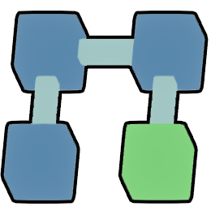

#  Nodulus

Nodulus is a puzzle game designed for touch that involves twisting and turning rods attached to cubes, created using Unity3D.

## Contributing

Keep up to date with Nodulus's progress, discussion, and ideas in the game's Slack Channel. [Click here](https://slackin-nodulus.herokuapp.com/) to join.

Have a cool idea for Nodulus and want to build it into the game? 

Found a bug or want to change the game's behavior? Just open a GitHub issue with your query.

## Libraries and Resources Used

1. [TouchKit](https://github.com/prime31/TouchKit)
2. [LeanTween](https://www.assetstore.unity3d.com/en/#!/content/3595)
3. [YamlDotNet for Unity](https://www.assetstore.unity3d.com/en/#!/content/36292)
4. [Post Processing Stack](https://www.assetstore.unity3d.com/en/#!/content/83912)
5. [Dice](https://www.assetstore.unity3d.com/en/#!/content/26670)

## Helpful Articles

1. http://hightalestudios.com/2017/09/reduce-draw-calls-using-vertex-colors/
2. http://thomasmountainborn.com/2016/05/25/materialpropertyblocks/
3. http://catlikecoding.com/unity/tutorials/rendering/part-19/

## Credits
Created, designed, and developed by Dan Kondratyuk. Please give credit to this project if you use it elsewhere. Open sourced under the [MIT license](LICENSE.md). :heart:
